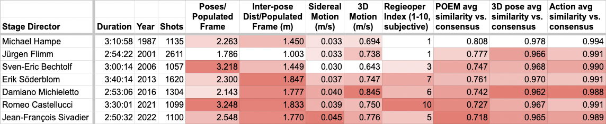
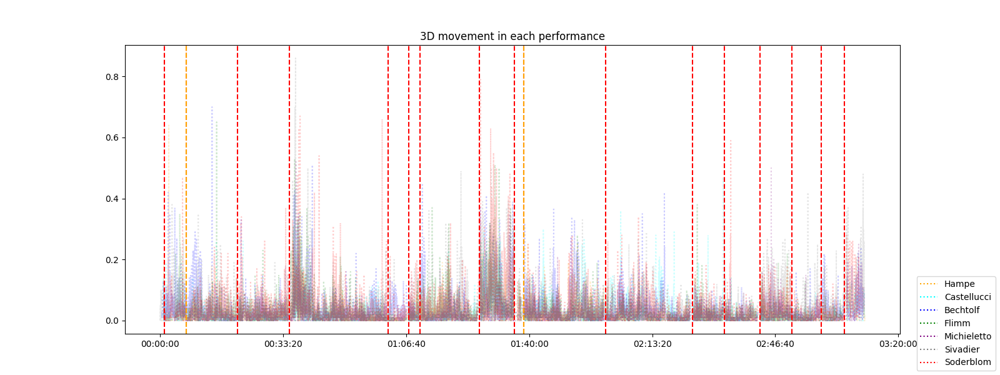
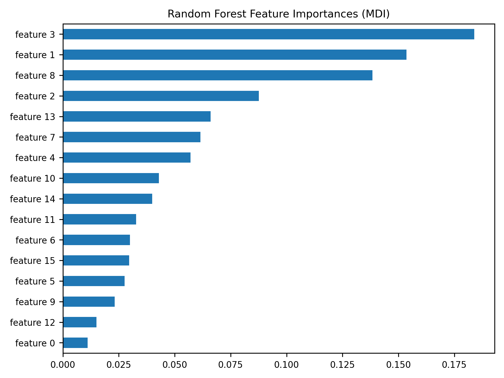

# The Director’s Signature: Stylometry of Theater Choreography via Pose and Action Estimation

<!-- .slide: data-background-video="assets/vis_fondly_phalp_coco.mp4" -->
<!-- .slide: data-background-size="contain" -->
<!-- .slide: data-background-video-loop -->
<!-- .slide: class="main-title" -->

---

## Introductions

 Michael Rau

 Peter Broadwell

 Simon Wiles

 Vijoy Abraham

:::

Welcome everyone, and thank you for joining us today. 
We will discuss our exploratory work in bringing Machine Learning techniques to the study of theater performance and, in particular, to the study of directorial style.

The project, titled **Machine Intelligence for Motion Exegesis, or MIME**, is the result of a collaboration between myself, Assistant Professor Michael Rau in Stanford University's Theater and Performance Studies department, and the Developer Team at Research Data Services at the Stanford University Library. That team consists of Vijoy Abraham, Peter Broadwell and Simon Wiles.

---

## ➡️ &nbsp; The Problem: Understanding Pose in Theater <!-- .element: class="fragment custom order-of-sections" -->

## ➡️ &nbsp; Methodology: Models and Tools <!-- .element: class="fragment custom order-of-sections" -->

## ➡️ &nbsp; The MIME Platform <!-- .element: class="fragment custom order-of-sections" -->

## ➡️ &nbsp; Results and Analysis <!-- .element: class="fragment custom order-of-sections" -->

## ➡️ &nbsp; Implications and Future Directions <!-- .element: class="fragment custom order-of-sections" -->

<!-- .slide: class="order-of-sections" -->

:::
Our talk today is divided into four sections, first I'll talk a bit about the problem that we're trying to solve, then Peter will give a technical overview, Simon will talk a little bit of about the platform, and then the bulk of our talk will be focused different types of analyses that our platform has allowed us to perform on a theatrical performance.

---

# The Problem

:::
Pose is fundamental to the theater. Pose and staging lies at the intersection of authorial intent, directorial vision, and is shaped by design choices and is ultimately mediated by the body of the performer.  So examining pose and staging in theater can be challenging since it sits at the heart of artistic expression and is so common and fundamental to the theater that it is often ignored. Our research addresses a fundamental question: How can we quantify and analyze the physical arrangements and movements of actors on stage to reveal meaningful insights about the director's creative contribution?

---

## The Problem (and Opportunity)

<!-- .slide: data-transition="slide-in fade-out" -->
:::
To answer this question, we turned to computer vision algorithms capable of detecting precise poses of the actors for every single frame of video in an archival production. Our methodology involves running pose detection on numerous archival videos, which generates hundreds of thousands of poses, and then sift through that pose data in order to draw meaningful conclusions.

---

## The Problem (and Opportunity)

<!-- .slide: data-transition="fade-in slide-out" -->

:::
In traditional theater studies, the concept of pose is often taken for granted. Directors, performers and audiences intuitively understand the power of a well-crafted tableau or a precisely choreographed sequence of movements.  In the theater, certain iconic poses or choreography can define productions, like Brecht’s silent scream choreography in Mother Courage, or Bob Fosse’s shoulder roll and arm pops in The Pajama Game or the collective poses of the ensemble in "A Chorus Line.” These production’s indelible poses helped make the work memorable, and are a signature of a particular director’s contribution to the production, and serve as a shorthand for identifying a director’s style.

However, these individual, memorable poses are just the tip of the iceberg. Our work lies in understanding the aggregate effect of all poses throughout a production, and even more ambitiously, across multiple productions by the same director, or by different interpretations of the same material by different directors. This approach brings us closer  to identifying the director's contribution to pose within the theater.

In film studies, there is a somewhat dated theory, called auteur theory which provides a framework for understanding a director's unique imprint on their work. Film directors have a range of tools at their disposal – camera angles, editing techniques, lighting choices – that make their stylistic signatures more readily apparent. In theater, however, the director's expressive capabilities are more constrained, and their contribution can be more elusive to pin down. In the theater, a director is constrained more by the physical space that they’re staging in, and the fact that their work happens in real-time, by live actors,who mediate the director’s staging.

This is where the computational analysis of pose in theater becomes interesting. By leveraging technologies like pose estimation and action recognition, we can begin to quantify aspects of theatrical performance that were previously left to subjective interpretation. We can analyze not just individual poses, but patterns of movement, spatial relationships between performers, and even the rhythm and flow of a production. Moreover, we can use pose analysis to distinguish between the work of different directors, regardless of the actors, performance text, or designer. In this way, we can get closer to understanding the specific contributions that a director provides. This is important because a director’s work is often occluded, sometimes not even mentioned within theater reviews, and most importantly, by several funding agencies considered, not “generative artform, but rather an interpretative artform” and thus not worthy of funding.

Moreover by combining the insights of traditional theater scholarship with the analytical power of computational methods, we can begin to develop a more comprehensive understanding of pose in theater. We can use data to support and enhance our qualitative analyses, and we can use our human understanding of theatrical context to guide our interpretation of the data.

I'm going to hand it over to Peter to talk about the methodology that we used. 

---

# Methodology

---

## Temporal-Convolutional vs. Transformer Models

 <strong>Open PifPaf</strong>  Temporal-convolutional 2D only, limited tracking

 <strong>PHALP</strong> (pose) + <strong>WiLoR</strong> (hands) Transformers-based 3D, more robust to occlusion

:::
As Michael mentioned, this project works with a corpus of films recorded with standard 2D cameras, so we can't rely on any special 3D camera or motion capture input. Being able to run accurate pose analyses on such moving images opens up basically the entire history of theater on film for analysis, but it can be quite challenging given "in the wild" live stage or studio recordings, with multiple cameras, cuts, occlusion, shadows and so forth. 

The first convolutional neural network-based pose estimation tools, such as OpenPose circa 2018, worked OK on recordings made in controlled environments and for things like TikTok videos with only one or two people who are in the frame at all times. But as you can see from the image on the left, even after some further refinements found in more recent versions of Open PifPaf, they struggle with in-the-wild videos such as the example shown here and are even more limited at estimating 3D coordinates and tracking multiple people in the shot.

As sometimes happens during the current era of AI research, a better model came along just in time, in the form a of a new generation of transformer-based models for computer vision, and more specifically via some great software tools for pose estimation and tracking from a research group at UC Berkeley.

---

## PHALP: Predicting Human Appearance, Location and Pose

Jathushan Rajasegaran, Georgios Pavlakos, Angjoo Kanazawa, Jitendra Malik. “Tracking People by Predicting 3D Appearance, Location & Pose.” arxiv.org/abs/2112.04477 (2021).  
https://github.com/broadwell/PHALP

:::
The most crucial of these tools is charmingly named PHALP -- you can see the acronym there -- and it achieves what is still state-of-the-art accuracy in pose estimation by interweaving the tasks of estimating human forms while also noting their appearance (that is, by extracting texture maps of their clothing and such) and tracking their trajectories over time in an estimated 3D space. This enables the transformer-based system to fill in occluded limbs and even entire poses that earlier models would "lose track of" for a few frames before finding them again.

---

## LART: Lagrangian Action Recognition with Tracking

Jathushan Rajasegaran, Georgios Pavlakos, Angjoo Kanazawa, Christoph Feichtenhofer, Jitendra Malik. “On the Benefits of 3D Pose and Tracking for Human Action Recognition.” arxiv.org/abs/2304.01199 (2023).  
https://github.com/broadwell/LART

:::
We augmented the 3D pose data from PHALP with a customized action recognition tool built by the same team, named Lagrangian Action Recognition with Transformers. This software also produces a 60-element vector in the AVA "Atomic Visual Actions" embedding space to describe every detected action by every pose in every frame, which provide much more computationally meaningful descriptions of the actions than the simple labels from the taxonomy (things like "watch, stand, walk").

---

## Probabilistic View-Invariant (2D+) Pose Embeddings

Sun, Jennifer J, Jiaping Zhao, Liang-Chieh Chen, Florian Schroff, Hartwig Adam and Ting Liu. “View-Invariant Probabilistic Embedding for Human Pose.” In Proceedings of the European Conference on Computer Vision, Springer, 2020, pp. 53-70.  
https://sites.google.com/view/pr-vipe

:::
Finally we adopted another embedding, this one from Google and CalTech, that projects the 2D coordinates of a pose into a 16-dimension space that situates poses closer together if they are probably similar in their actual 3D representations. Note that we also get the estimated 3D coordinates of the poses from PHALP, but as we'll see later, sometimes this probabilistic embedding is more useful for analysis.

---

# The MIME Platform

:::
* To allow us to experiment and work with these techniques and models, we have built a platform to support our development and to allow us to make this work accessible to Prof. Rau and to other researchers

* it's really the platform that makes it easy for us to construct pipelines for processing and running inference against videos of theatrical performances.

* it's a place where we can experiment with and evaluate different approaches and technologies, and we're also able to incorporate new developments as they arise, for example the shift from OpenPifPaf (the convolutional model) to the transformer-based PHALP model.

* Furthermore the platform allow us to interrogate the results using things like
  * similarity metrics
  * nearest neighbour search
  * clustering,
  * and to visualize and explore the various data we're able to produce.

---

# Results & Analysis

---

## Recurring Poses and Thematic Pose Analysis

:::
Using MIME's timeline, we can easily analyze a production in terms of repetetive gestures. A researcher can simply select a specific pose in the production, and the timeline will show where else the pose shows up in the performance. You can jump easily to those spots in the performance, or you use it chart certain thematic recurrances. The timeline view gives you a distant view of the performance, where you can see chart entrances and exits of performers, and as get a sense of some aspects rhythmic or thematic elements by noting what repeats within the performance and when.

---

## Corpus Studies: Assembling Multiple Works per Director

:::
To address the question of what the pose, action, motion and position data we can extract from recordings via the MIME platform might tell us about how theater directors deploy these elements to produce specific effects in their own personal style, we focused on three high-profile, contemporary "auteur" directors: Bill T. Jones, Romeo Castellucci, and Krzysztof Warlikowski, selecting 10 or 11 performances each has directed during his career. We ran video recordings of these performances through the MIME pipeline without alteration, other than upscaling some of them to at least HD quality, because the models work better with high-resolution footage.

As you can see, this produced 10-20 hours of pose data per director.

---

## Which Features Are Best for Differentiating between Directors?

Pose motion and distance statistics

View-invariant pose embeddings

:::
We framed our approach as a performance-to-director classification problem, investigating which pose, action, motion and distance data elements are most effective at predicting the correct stage director for a given performance. The first steps was a basic "leave one out" test comparing the aggregated, averaged feature vectors across each director's entire collection to the average feature ector of one "held out" performance, using cosine similarity, in what's basically a very simple multidimensional kernel-based similarity comparison approach.

This approach found that the basic pose and motion statistics were not as effective at differentiating works by Castellucci and Warlikowski. However, they were quite good at telling the difference between Bill T. Jones and the other two directors. Meanwhile, the aggregated pose embeddings were more successful at differentiating the works of all three directors.

---

## Which Features Are Best for Differentiating between Directors?

:::
Here we've highlighted the performances with greater amounts of motion. Most are from Bill T. Jones, who primarily creates dance works, while the other two directors tend to direct mostly operas and other more static forms of stage plays. So the motion and distance-based comparison may be better at picking up on the difference in primary genres between these directors. Meanwhile, the pose embedding approach seems to be picking up something distinctive about each director's individual style. We'll look into what that might be in just a minute.

---

## Which Features Are Best for Differentiating between Directors?

Body keypoint coords (3D)

Action recognition embeddings

:::
Here are some further leave-one-out classification experiments with the 3D pose coordinates and action recognition vectors used as features.
The action recognition embeddings do seem to be somewhat better than the 3D coordinates for telling the directors apart.

---

## Which Features Are Best for Differentiating between Directors?

:::
Here are some results with slightly more sophisticated classification algorithms and using 10-fold cross-validation with different random seeds to try to get a better sense of how these approaches might perform with a larger, more diverse dataset. They do suggest that some algorithms are better at detecting some aspects of even the large-scale motion and distance data that differentiate directors, so that is worth exploring further, while the effectiveness of the embedding-based inputs does drop a bit when the training set is small.

---

## Hands and Delsarte

Delsarte Pose

MIME Detection

:::
One of the more recent developments that we've been working on with MIME is to take the 19th century pose system that has a long, influential and bizarre history, particularly strong in American modern modern dance. The delsarte system has a series of codified full-figure and hand poses, and using the search function of MIME, we were able to identify precisely where and when certain actors would arrive in certain poses. These poses allowed us to create "Delsarte Thumbprints" to not only see which gestures are reminiscient of Delsarte's choreography, 

---

## Delsarte Thumbprint

Delsarte Thumbprint for Bill T Jones

MIME Detection

:::

Describe the results here?

---

## Visualizing Directors' Pose "Repertoires"

:::
To explore how the directors' pose "repertoires" might be distributed through the view-invariant pose embedding space, and hopefully get a better sense of what aspects of these embeddings were helping to differentiate the directors, we plotted a sample of all of their pose embeddings into a 2D space via UMAP projection as color-coded dots. The larger hexagons represent each director's overall average pose embedding. Although we can't directly translate these averages into poses, we can search for the most similar poses in the entire data set thanks to MIME's powerful vector database, and we've shown some of those here in the callouts.

This projection does seem to reveal useful insights, like the overall greater similarity between Castellucci’s and Warlikowski’s pose repertoires relative to Jones’s, and the callouts highlight how Jones tends to employ dramatically contorted poses, Castellucci to favor hunched-over standing postures, and Warlikowski to deploy figures in an active sitting position.

---

## Direct Comparison: Multiple Directors' Stagings of the Same Work

 Michael Hampe

 Romeo Castellucci

 Erik Söderblom

:::

Our final analytical experiment to date, which is still a work in progress, sort of inverts the previous approach and instead considers what MIME can reveal when comparing staging from seven different directors who are all directing the same work -- in this case the famous Mozart/Da Ponte opera Don Giovanni from 1787.

The screenshots below show some pose estimation output from each of the directors' stagings -- note that in every case this is the same scene, from the finale of Act I.

---

## Direct Comparison: Multiple Directors' Stagings of the Same Work

 Sven-Eric Bechtolf

 Damiano Michieletto

 Jean-François Sivadier

:::
The table above gives derived statistics of the performances, highlighting entries with greater degrees of movement, distance between actors, and overall deviation from the average pose and actions. As the table is also ordered chronologically, it does seem to indicate a general tendency for performances to get more creative and/or "non-traditional" in their stagings over time, as quantified via pose and action estimation.

---

## Aligning Performances (by Music) to Get Average Pose "Consensus"

:::
Comparing the performances of Don Giovanni involved aligning all of them down to the sub-second level, specifically so that we could calculate the average poses and actions deployed at each moment of the opera -- building what folklorists refer to as the "consensus performance" or "tradition dominant" of a cultural expressive form -- and then calculate the degree to which each director's staging deviates from this consensus at each moment.

Practically speaking, the easiest way to align the recordings, which only works because the work is an opera, involves extracting the musical pitches heard at each timecode and applying the dynamic time warping algorithm to match the pitch chroma of different performances to compute a warping path that allows us to align them despite significant differences in tempo, non-musical action, and the occasional omission of certain scenes.

---

## Comparing Each Director's Staging to the "Consensus" Average

  
  

:::
As a final analytical output of the effort just described, we can plot the pose or motion similarity attributes of each of the 7 performances to the average  "consensus" performance across the entire work (the dashed lines are scene and act boundaries). This is still a work in progress, but we can use this analysis to detect patterns such as certain scenes in which stagings are more likely to deviate from the consensus poses, and eventually use this to highlight automatically where directors might use especially distinctive poses and actions. Stay tuned...

---

# Implications

:::
The computational analysis of pose and action in theatrical performances, as presented in this research, opens new avenues for understanding directorial style. This is particularly significant because the creative contributions of directors are often overlooked or reduced to a single memorable moment or tableau. In reality, the staging of a theatrical production is a meticulous process that unfolds over weeks or even months, with the director crafting every moment of the performance. By leveraging this technology to examine their work in minute detail, we gain a more comprehensive view of their artistic vision.
And from my point of view this technology is opening whole new ways of examining a performance, so I’m going to quickly go over some of the ways in which pose can allow for a unique analyses of a performance.  By using the pose similarity function we can start to identify recurring poses, symmetry within poses, and looking at the overall timeline view of a performance, to see the rhythmic ebb and flow of a staging. Using pose we can more readily identify the common themes and stylistic elements that define a director’s creative output, and separate out their unique contribution, divorced from the work of the performers, or the constraints of the particular text or physical space.
By analyzing pose and movement across a director’s entire body of work, we can identify recurring patterns and trace the evolution of their style—elements that might remain elusive when examining individual performances in isolation. Additionally, this method enables objective comparisons between different directors’ interpretations of the same material, potentially revealing new dimensions of artistic expression and decision-making. By comparing different director’s versions of the same work, we can start to see how physical expression, and spatial storytelling evolves over time, or across different cultures, or in specific canonical works, look at how a director’s staging deviates from the traditional norms. Scholars could look at certain themes or characters that are represented physically over time, an easy topic would be to look at how kings are represented in different stagings, to see how poses associated with power can vary between productions. This technology could also be used to chart how an actor’s physical choices evolve through rehearsals and performances. Then scholars might use the rehearsal and performance pose data to study methodologies of actor training or directorial vision. Given the precision of the timeline view, we can also correlate pose data with audience response (based on applause or laughter) to see which types of physical expression elicit the strongest responses, so that could deepen our understanding of how audiences engage with a live performance. As a practicing artist, I see this tool enabling new types of staging, helping to rethink pose within canonical performances, and inspiring innovative uses of pose. And ultimately I see the potential of this technology to create an unprecedented record of a production’s physical language, which can be a valuable resource for future research, teaching, or restaging. 
Moreover, the implications of this research extend beyond theater studies. First, this methodology can be readily adapted to analyze performances in film, opera, dance, and other any of the arts involving human movement. Beyond the arts, this approach could also be applied to diverse fields, from analyzing political speeches to studying the biomechanics of physiology and sports.
However, it is crucial to acknowledge the ethical considerations and limitations inherent in this approach. As with all AI, there is a danger in hallucinations and incorrect pose estimations. There are always responsible use considerations when working with archival materials of directors, actors. This presents a complex ethical landscape that requires careful navigation, and as a team we’ve developed clear guidelines and frameworks to ensure respectful and responsible use of these technologies and materials.
From an analytical standpoint, we must also recognize the limitations of focusing solely on pose and action. Theater is a multifaceted art form, and while pose is a critical component, it represents only one thread in a rich tapestry that includes dialogue, set design, lighting, sound, and more. Without taking those other elements into account, we run the risk of not interpreting a production properly. While this computational analysis provides valuable insights, it should be viewed as a complement to, rather than a replacement for, traditional methods of artistic analysis. It offers a narrow but powerful lens through which to examine performance, enriching our understanding rather than supplanting it.
Finally, it is important to note that this computational approach cannot definitively determine directorial intent. The patterns observed may stem from conscious directorial choices, actor improvisations, or even unintentional recurring elements. As such, these findings should serve as a starting point for deeper, more nuanced investigations rather than as definitive conclusions.
In conclusion, while this research presents exciting possibilities for quantitative analysis in the arts, its true value lies in its potential to complement and enhance traditional scholarly approaches. By integrating computational methods with expert human interpretation, we can develop a more comprehensive understanding of theatrical performance and directorial style, ultimately enriching both academic discourse and artistic practice.
Thank you.

---

# Thank You&#x21;

---

# Appendix

---

## Feature Importances: Motion and Distance (Random Forest)

 Permutation Importance

 Mean Decrease in Impurity

---

## Collinearity of Motion and Distance Features

---

## 3D Keypoint Importances (Random Forest)

---

## Collinearity of 3D Keypoint Coordinates

---

## Feature Importances: View-Invariant Pose Embeddings

 Permutation Importance (Gaussian Naive Bayes)

 Mean Decrease in Impurity (Random Forest)

---

## Collinearity of View-Invariant Pose Vector Features

---

## Pose "Repertoires" Visualization (Labeled Performances)

---

## Action "Repertoires" Visualization

