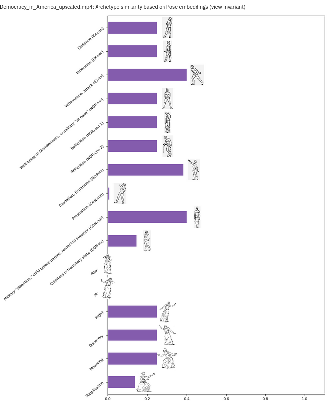

# The Director’s Signature: Stylometry of Theater Choreography via Pose and Action Estimation

<!-- .slide: data-background-video="assets/vis_fondly_phalp_coco.mp4" -->
<!-- .slide: data-background-size="contain" -->
<!-- .slide: data-background-video-loop -->
<!-- .slide: class="main-title" -->

---

## Introductions

 Michael Rau

 Peter Broadwell

 Simon Wiles

 Vijoy Abraham

:::

Thank you for joining us today.

We'll be discussing our exploratory work bringing Machine Learning techniques to the study of theater performance and directorial style.

The project, Machine Intelligence for Motion Exegesis, or MIME, is a collaboration between myself, Assistant Professor Michael Rau in Stanford's Theater and Performance Studies department, and the Developer Team at Research Data Services at Stanford University Library: Vijoy Abraham, Peter Broadwell and Simon Wiles.

---

## ➡️ &nbsp; The Problem: Understanding Pose in Theater <!-- .element: class="fragment custom order-of-sections" -->

## ➡️ &nbsp; Methodology: Models and Tools <!-- .element: class="fragment custom order-of-sections" -->

## ➡️ &nbsp; The MIME Platform <!-- .element: class="fragment custom order-of-sections" -->

## ➡️ &nbsp; Results and Analysis <!-- .element: class="fragment custom order-of-sections" -->

## ➡️ &nbsp; Implications and Future Directions <!-- .element: class="fragment custom order-of-sections" -->

<!-- .slide: class="order-of-sections" -->

:::
Our talk has six sections: first I'll discuss the problem we're solving, then Peter will give a technical overview, Simon will discuss the platform, and the bulk of our talk will focus on different analyses our platform has enabled on theatrical performance, and I'll end with some thoughts about the future of this work.

---

# The Problem

:::
Pose is fundamental to theater. Pose and staging lie at the intersection of authorial intent and directorial vision, pose is shaped by design choices of the costumes, set and lights and mediated by the performer's body. In traditional theater studies, pose is often taken for granted. Directors, performers and audiences intuitively understand the power of well-crafted tableaux or precisely choreographed movement sequences. Certain iconic poses define productions: Brecht's silent scream choreography in Mother Courage, Bob Fosse's shoulder rolls and arm pops in The Pajama Game, or the ensemble poses in "A Chorus Line." These indelible poses make work memorable and serve as shorthand for identifying directorial style. Examining pose in theater is challenging since it sits at the heart of artistic expression and is so fundamental it's often ignored. Our research addresses one major question: How can we quantify and analyze actors' physical arrangements and movements to reveal meaningful insights about the director's creative contribution?

---

## The Problem (and Opportunity)

<!-- .slide: data-transition="slide-in fade-out" -->

:::
To answer this question, we turned to computer vision algorithms to precisely detect actor poses for every frame of an archival theatrical production. Our methodology runs pose detection on numerous videos, generating hundreds of thousands of poses, then sifts through that data to draw meaningful conclusions. Our work doesn't just focus on one meaningful pose or tableaux but instead seeks to understand the aggregate effect of all poses throughout a production, and across multiple productions by the same director or different interpretations by different directors. This brings us closer to identifying the director's contribution to pose in theater.

---

## The Problem (and Opportunity)

<!-- .slide: data-transition="fade-in slide-out" -->

:::
By leveraging pose estimation and action recognition, we can quantify theatrical performance aspects previously left to subjective interpretation. We analyze not just individual poses, but movement patterns, spatial relationships between performers, and production rhythm and flow. We can use pose analysis to distinguish between different directors' work, regardless of actors, text, or designers, getting closer to understanding specific directorial contributions. 

I'll hand it over to Peter to discuss our methodology.

---

# Methodology

---

## Temporal-Convolutional vs. Transformer Models

 <strong>Open PifPaf</strong>  Temporal-convolutional 2D only, limited tracking

 <strong>PHALP</strong> (pose) + <strong>WiLoR</strong> (hands) Transformers-based 3D, more robust to occlusion

:::
As Michael mentioned, this project works with a corpus of films recorded with standard 2D cameras, so we can't rely on any special 3D camera or motion capture input. Being able to run accurate pose analyses on such moving images opens up basically the entire history of theater on film for analysis, but it can be quite challenging given "in the wild" live stage or studio recordings, with multiple cameras, cuts, occlusion, shadows and so forth.

The first convolutional neural network-based pose estimation tools, such as OpenPose circa 2018, worked OK on recordings made in controlled environments and for things like TikTok videos with only one or two people who are in the frame at all times. But as you can see from the image on the left, even after some further refinements found in more recent versions of Open PifPaf, they struggle with in-the-wild videos such as the example shown here and are even more limited at estimating 3D coordinates and tracking multiple people in the shot.

As sometimes happens during the current era of AI research, a better model came along just in time, in the form a of a new generation of transformer-based models for computer vision, and more specifically via some great software tools for pose estimation and tracking from a research group at UC Berkeley.

---

## PHALP: Predicting Human Appearance, Location and Pose

Jathushan Rajasegaran, Georgios Pavlakos, Angjoo Kanazawa, Jitendra Malik. “Tracking People by Predicting 3D Appearance, Location & Pose.” arxiv.org/abs/2112.04477 (2021).  
https://github.com/broadwell/PHALP

:::
The most crucial of these tools is charmingly named PHALP -- you can see the acronym there -- and it achieves what is still state-of-the-art accuracy in pose estimation by interweaving the tasks of estimating human forms while also noting their appearance (that is, by extracting texture maps of their clothing and such) and tracking their trajectories over time in an estimated 3D space. This enables the transformer-based system to fill in occluded limbs and even entire poses that earlier models would "lose track of" for a few frames before finding them again.

---

## LART: Lagrangian Action Recognition with Tracking

Jathushan Rajasegaran, Georgios Pavlakos, Angjoo Kanazawa, Christoph Feichtenhofer, Jitendra Malik. “On the Benefits of 3D Pose and Tracking for Human Action Recognition.” arxiv.org/abs/2304.01199 (2023).  
https://github.com/broadwell/LART

:::
We augmented the 3D pose data from PHALP with a customized action recognition tool built by the same team, named Lagrangian Action Recognition with Transformers. This software also produces a 60-element vector in the AVA "Atomic Visual Actions" embedding space to describe every detected action by every pose in every frame, which provide much more computationally meaningful descriptions of the actions than the simple labels from the taxonomy (things like "watch, stand, walk").

---

## Probabilistic View-Invariant (2D+) Pose Embeddings

Sun, Jennifer J, Jiaping Zhao, Liang-Chieh Chen, Florian Schroff, Hartwig Adam and Ting Liu. “View-Invariant Probabilistic Embedding for Human Pose.” In Proceedings of the European Conference on Computer Vision, Springer, 2020, pp. 53-70.  
https://sites.google.com/view/pr-vipe

:::
Finally we adopted another embedding, this one from Google and CalTech, that projects the 2D coordinates of a pose into a 16-dimension space that situates poses closer together if they are probably similar in their actual 3D representations. Note that we also get the estimated 3D coordinates of the poses from PHALP, but as we'll see later, sometimes this probabilistic embedding is more useful for analysis.

---

# The MIME Platform

&nbsp;

### Pipeline → Database → API Server → Interfaces

:::

So how do we operationalize these models and techniques?  How do we take the outputs of the inferences and predictions they generate and make them useful for exploring our research questions?

The MIME platform consists of a modular ingestion pipeline, a database with sophisticated vector storage and indexing capabilities, an application and API server, and a collection of related interfaces that allow us to investigate and analyze the data we have assembled using things like
* similarity metrics
* nearest neighbour search
* clustering,
* and a variety of different visualizations.

The loosely-coupled nature of these components allows us to experiment with different approaches while still providing a consistent framework for our development.

---

## Pipeline

<ul style="margin-top:2rem">
  <li><strong style="font-size:2rem">Inference Tasks</strong>
    <ul>
      <li>Pose Estimation (PHALP/4D-Humans)</li>
      <li>Action Estimation (LART)</li>
      <li>View-Invariant Embeddings (Pr-VIPE)</li>
      <li>Shot Detection (TransNetV2)</li> <!-- .element: class="fragment" -->
      <li>Face Recognition (ArcFace/DeepFace)</li> <!-- .element: class="fragment" -->
      <li>Hand Estimation (WiLoR)</li> <!-- .element: class="fragment" -->
    </ul><!-- .element: class="fragment" -->
  </li>

  <li style="margin-top:2rem"><strong style="font-size:2rem">Coordination Steps</strong>
    <ul>
      <li>coordination of hands and poses</li>
      <li>segmentation into movelets</li><!-- .element: class="fragment" -->
      <li>calculation of pose-interest and action-interest metrics</li><!-- .element: class="fragment" -->
      <li>pregeneration of pose and face clusters</li><!-- .element: class="fragment" -->
    </ul> <!-- .element: class="fragment" -->
  </li><!-- .element: class="fragment" -->
</ul> <!-- .element: class="fragment" -->

:::

The pipeline is first and foremost about running the inference tasks.

In addition to the three core technologies that Peter already introduced our ingestion pipeline can also optionally perform Shot-Detection, Face Recognition, and Hand Estimation,

and once we have all this information we also need to perform a number of coordination tasks

~since the hand estimation and pose estimation come from separate models we need to perform some additional analysis to join them up together.~

---

## Database

* PostgreSQL / pgvector
* Multiple similarity metrics
* ANN Indexes (`IVFFlat`, `HNSW`)

## Application / API Server

* Machine-Learning dependencies
* Full Data-Science stack
* Jupyter Notebook server <!-- .element: class="fragment" -->
* FastAPI server <!-- .element: class="fragment" -->

<!-- .element: class="fragment" -->

:::

These inference and computational tasks are lengthy and expensive, so all this data is ingested ultimately into our database server for subsequent retrieval and analysis.  For our vector storage and querying capabilities we're using pgvector which offers a number of affordances for the performant Approximate Nearest Neighbour searches on which much of the functionality is built one way or another.

The Application and API server is a container that has all our machine-learning dependencies available and its where all our machine learning and back-end code runs

The container is also home to a Jupyter Notebook server and a FastAPI server that exposes the endpoints that are consumed by our web interface

---

# The MIME Platform

<section>

<svg class="spotlight" viewBox="0 0 1080 300" preserveAspectRatio="none">
  
  <defs>
    <mask id="spotlight-mask">
      <rect width="1080" height="300" fill="white" opacity=".6"/>
      <rect x="0" y="0" width="1080" height="300" fill="black"/>
    </mask>
  </defs>
  <rect width="1080" height="300" fill="#000" mask="url(#spotlight-mask)"/>
</svg>

:::

This is a diagram of the platform, more-or-less as it exists now
* each of these parts can be easily swapped in and out as we're experimenting

* The whole thing is orchestrated with docker which a number of important benefits for a platform like this.

---

# Interfaces

:::
We don't have time for a live demonstration today, so instead I'll very quickly share some screenshots from some of the interface affordances we have available.

---

<!-- .slide: data-transition="slide-in fade-out"-->

:::
This is a timeline view for a single performance that lets us see how our data are distributed along a temporal axis.

---

<!-- .slide: data-transition="fade" -->

:::
This is our first iteration of a pose similariy search interface.

---

<!-- .slide: data-transition="fade" -->

:::
Here is a full view of a single frame.

---

<!-- .slide: data-transition="fade" -->

:::
We have face clustering plotted along a time axis.

---

<!-- .slide: data-transition="fade" -->

:::
A 3D scene reconstruction

---

<!-- .slide: data-transition="fade" -->

:::
This is an interactive 2D UMAP projection of poses clustered with the HDBSCAN algorithm.

---

<!-- .slide: data-transition="fade-in slide-out" -->

:::
And finally this is one from our new interface showing yours truly performing a pose in front of a webcam and using that to search across a corpus of recordings.

---

# Results & Analysis

---

## Recurring Poses and Thematic Pose Analysis

<video controls muted src="assets/Bausch4.mp4"></video>
:::
Using MIME's timeline, we can easily analyze a production in terms of repetetive gestures. A researcher can simply select a specific pose in the production, and the timeline will show where else the pose shows up in the performance. You can jump easily to those spots in the performance, or you use it chart certain thematic recurrances. The timeline view gives you a distant view of the performance, where you can see chart entrances and exits of performers, and as get a sense of some aspects rhythmic or thematic elements by noting what repeats within the performance and when.

---

## Corpus Studies: Assembling Multiple Works per Director

:::
To address the question of what the pose, action, motion and position data we can extract from recordings via the MIME platform might tell us about how theater directors deploy these elements to produce specific effects in their own personal style, we focused on three high-profile, contemporary "auteur" directors: Bill T. Jones, Romeo Castellucci, and Krzysztof Warlikowski, selecting 10 or 11 performances each has directed during his career. We ran video recordings of these performances through the MIME pipeline without alteration, other than upscaling some of them to at least HD quality, because the models work better with high-resolution footage.

As you can see, this produced 10-20 hours of pose data per director.

---

## Which Features Are Best for Differentiating between Directors?

Pose motion and distance statistics

View-invariant pose embeddings

:::
We framed our approach as a performance-to-director classification problem, investigating which pose, action, motion and distance data elements are most effective at predicting the correct stage director for a given performance. The first steps was a basic "leave one out" test comparing the aggregated, averaged feature vectors across each director's entire collection to the average feature vector of one "held out" performance, using cosine similarity, in what's basically a very simple multidimensional kernel-based similarity comparison approach.

This approach found that the basic pose and motion statistics were not as effective at differentiating works by Castellucci and Warlikowski. However, they were quite good at telling the difference between Bill T. Jones and the other two directors. Meanwhile, the aggregated pose embeddings were more successful at differentiating the works of all three directors.

---

## Which Features Are Best for Differentiating between Directors?

:::
Here we've highlighted the performances with greater amounts of motion. Most are from Bill T. Jones, who primarily creates dance works, while the other two directors tend to direct mostly operas and other more static forms of stage plays. So the motion and distance-based comparison may be better at picking up on the difference in primary genres between these directors. Meanwhile, the pose embedding approach seems to be picking up something distinctive about each director's individual style. We'll look into what that might be in just a minute.

---

## Which Features Are Best for Differentiating between Directors?

Body keypoint coords (3D)

Action recognition embeddings

:::
Here are some further leave-one-out classification experiments with the 3D pose coordinates and action recognition vectors used as features.
The action recognition embeddings do seem to be somewhat better than the 3D coordinates for telling the directors apart.

---

## Which Features Are Best for Differentiating between Directors?

:::
Here are some results with slightly more sophisticated classification algorithms and using 10-fold cross-validation with different random seeds to try to get a better sense of how these approaches might perform with a larger, more diverse dataset. They do suggest that some algorithms are better at detecting some aspects of even the large-scale motion and distance data that differentiate directors, so that is worth exploring further, while the effectiveness of the embedding-based inputs does drop a bit when the training set is small.

---

## Hands and Delsarte

Delsarte Pose

MIME Detection

:::
One of the more recent developments that we've been working on with MIME is to take the 19th century pose system, invented by Francois Delsarte that has a long, influential and bizarre history, and to use those diagrams of poses that he invented and see where they showed up in our contemporary work. The delsarte system has a series of codified full-figure and hand poses, that express certain ideas and emotions and using the search function of MIME, we were able to identify precisely where and when certain actors would arrive in Delsarte poses. These results allowed us to create "Delsarte Thumbprints" to not only see which gestures are reminiscient of Delsarte's choreography, and to track the frequency through which they appear in a production.

---

## Delsarte Thumbprint

Bill T Jones's Fondly Do We Hope

Romeo Castellucci's Democracy in America

:::
Here you can see two different "thumbprints"--that demonstrate the the difference quantities of pose throughout the show. Bill T. Jones' production shows far more "Prostration" than Castellucci. And Castellucci's production features far more poses of supplication. And while it may seem a little silly to use these 19th century melodramatic poses to analize a works of contemporary theater, this method points towards ways in which this technology could be used to trace the genelogy of artistic movements, and the subtle ways that historical aesthetics shape our contemprary tastes. 

---

## Visualizing Directors' Pose "Repertoires"

:::
To explore how the directors' pose "repertoires" might be distributed through the view-invariant pose embedding space, and hopefully get a better sense of what aspects of these embeddings were helping to differentiate the directors, we plotted a sample of all of their pose embeddings into a 2D space via UMAP projection as color-coded dots. The larger hexagons represent each director's overall average pose embedding. Although we can't directly translate these averages into poses, we can search for the most similar poses in the entire data set thanks to MIME's powerful vector database, and we've shown some of those here in the callouts.

This projection does seem to reveal useful insights, like the overall greater similarity between Castellucci’s and Warlikowski’s pose repertoires relative to Jones’s, and the callouts highlight how Jones tends to employ dramatically contorted poses, Castellucci to favor hunched-over standing postures, and Warlikowski to deploy figures in an active sitting position.

---

## Direct Comparison: Multiple Directors' Stagings of the Same Work

 Michael Hampe

 Romeo Castellucci

 Erik Söderblom

:::

Our final analytical experiment to date, which is still a work in progress, sort of inverts the previous approach and instead considers what MIME can reveal when comparing staging from seven different directors who are all directing the same work -- in this case the famous Mozart/Da Ponte opera Don Giovanni from 1787.

The screenshots below show some pose estimation output from each of the directors' stagings -- note that in every case this is the same scene, from the finale of Act I.

---

## Direct Comparison: Multiple Directors' Stagings of the Same Work

 Sven-Eric Bechtolf

 Damiano Michieletto

 Jean-François Sivadier

:::
The table above gives derived statistics of the performances, highlighting entries with greater degrees of movement, distance between actors, and overall deviation from the average pose and actions. As the table is also ordered chronologically, it does seem to indicate a general tendency for performances to get more creative and/or "non-traditional" in their stagings over time, as quantified via pose and action estimation.

---

## Aligning Performances (by Music) to Get Average Pose "Consensus"

:::
Comparing the performances of Don Giovanni involved aligning all of them down to the sub-second level, specifically so that we could calculate the average poses and actions deployed at each moment of the opera -- building what folklorists refer to as the "consensus performance" or "tradition dominant" of a cultural expressive form -- and then calculate the degree to which each director's staging deviates from this consensus at each moment.

Practically speaking, the easiest way to align the recordings, which only works because the work is an opera, involves extracting the musical pitches heard at each timecode and applying the dynamic time warping algorithm to match the pitch chroma of different performances to compute a warping path that allows us to align them despite significant differences in tempo, non-musical action, and the occasional omission of certain scenes.

---

## Comparing Each Director's Staging to the "Consensus" Average

  
  

:::
As a final analytical output of the effort just described, we can plot the pose or motion similarity attributes of each of the 7 performances to the average  "consensus" performance across the entire work (the dashed lines are scene and act boundaries). This is still a work in progress, but we can use this analysis to detect patterns such as certain scenes in which stagings are more likely to deviate from the consensus poses, and eventually use this to highlight automatically where directors might use especially distinctive poses and actions. Stay tuned...

---

# Implications

:::
To recap, using MIME, we can

Use pose similarity functions, to identify recurring poses, symmetry, and the rhythmic ebb and flow of staging. We can identify aggegrate stylistic elements that define a director's output, separating their unique contribution from performers' work or textual constraints. We can identify poses that make reference to historical movements and style and trace the evolution of a choreography. MIME also enables objective comparisons between different directors' interpretations, revealing new dimensions of artistic expression.

We can compare different directors' versions to show how physical expression and spatial storytelling evolve over time, across cultures, or in canonical works. Scholars could examine how themes or characters are represented physically—for instance, how kings are staged to show varying representations of power between productions.

This technology could chart how actors' physical choices evolve through rehearsals. Given the precision of the timeline view, we can correlate pose data with audience response—applause or laughter—to see which physical expressions elicit the strongest responses, deepening our understanding of audience engagement.

It creates an unprecedented record of a production's physical language—valuable for future research, teaching, or restaging. Beyond theater, this methodology could be adapted to film, opera, dance, and other movement-based arts. It could also apply to diverse fields from political speeches to sports biomechanics.

However, we must acknowledge ethical considerations and limitations. Like all AI, there's danger in incorrect pose estimations. Working with archival materials requires careful navigation—we've developed clear guidelines ensuring respectful, responsible use.

We must recognize the limitations of focusing solely on pose. Theater is multifaceted—pose is critical but represents only one thread in a rich tapestry including dialogue, set design, lighting, and sound. This analysis should complement, not replace, traditional artistic analysis methods.

This computational approach cannot definitively determine directorial intent. Observed patterns may stem from conscious choices, actor improvisations, or unintentional elements. These findings should serve as starting points for deeper investigations, not definitive conclusions.

While this research presents exciting quantitative analysis possibilities, its true value lies in complementing traditional scholarly approaches. By integrating computational methods with human interpretation, we develop a more comprehensive understanding of theatrical performance and directorial style, enriching both academic discourse and artistic practice.

Thank you.
---

# Thank You&#x21;

---

# Appendix

---

## Feature Importances: Motion and Distance (Random Forest)

 Permutation Importance

 Mean Decrease in Impurity

---

## Collinearity of Motion and Distance Features

---

## 3D Keypoint Importances (Random Forest)

---

## Collinearity of 3D Keypoint Coordinates

---

## Feature Importances: View-Invariant Pose Embeddings

 Permutation Importance (Gaussian Naive Bayes)

 Mean Decrease in Impurity (Random Forest)

---

## Collinearity of View-Invariant Pose Vector Features

---

## Pose "Repertoires" Visualization (Labeled Performances)

---

## Action "Repertoires" Visualization

